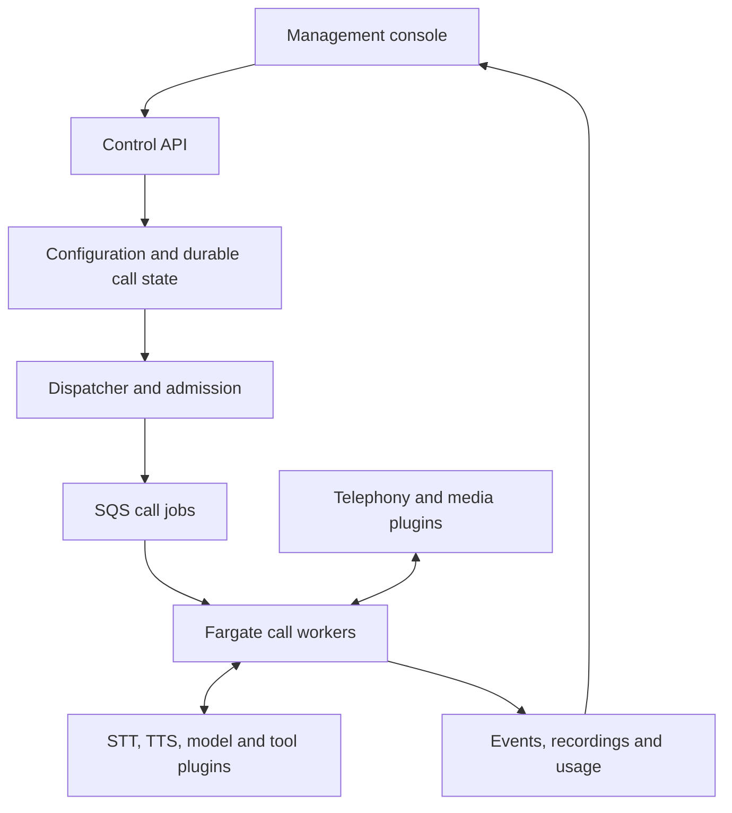

# OVO

### Open Voice Orchestrator

**Build, run, and observe voice agents on your own infrastructure. Everything is a plugin.**

OVO is a TypeScript-first voice-agent platform being developed by [Winsen Labs](https://winsen.ai). It brings conversation orchestration, telephony integrations, agent configuration, and call observability into one self-hostable system.

Start with a message and a few variables. Add approved FAQ answers, a conversational model, or business tools when your use case needs them. Choose the providers behind each capability and manage your agents through a web console.

> **Project status: design and specification.** This repository currently contains the product requirements, architecture, research assignments, and engineering plan. There is no runnable application or published OVO package yet. The capabilities below describe the intended implementation.

[Documentation](docs/README.md) · [Architecture](docs/04-architecture.md) · [Roadmap](docs/06-engineering-plan.md) · [Build-agent instructions](docs/02-agent-build-guide.md)

## Why OVO?

Operating a voice agent means coordinating audio, conversation state, external services, and business actions in real time. A caller can interrupt while a tool is running. A provider can return audio after a response has been cancelled. A deployment can begin halfway through a call.

OVO is designed to make those interactions explicit, configurable, and observable. Its focus is reliable execution, interchangeable components, and a console that lets an operator understand what happened during a call.

## Everything is a plugin

The conversation engine itself is replaceable. So are the capabilities around it:

- **Conversation:** scripted behavior, FAQ matching, supplied-context dialogue, and tool-using agents.
- **Voice:** speech recognition, synthesis, voice activity detection, turn detection, and playback.
- **Connectivity:** telephony control, media transports, and business integrations.
- **Execution:** model adapters, tool policies, processing speech, and recovery behavior.
- **Operations:** persistence adapters, recordings, secrets, telemetry, evaluations, and cost accounting.
- **Console:** configuration forms and call-inspection extensions.

A small host composes plugins through typed contracts, declared dependencies, and scoped lifecycles. First-party plugins follow the same contracts as external plugins. Active calls pin their configuration and plugin versions.

Plugins are normally composed inside a process; modularity does not require a network hop between every audio-processing stage. Supported combinations must pass conformance tests. See the [plugin-first architecture requirements](docs/08-plugin-first-fargate.md).

## Four ways to build an agent

| Mode | Example | Model requirement |
|---|---|---|
| Message with variables | Read an appointment reminder or account update | No LLM; STT optional for one-way delivery |
| Script and FAQ | Follow an approved script and answer known questions | Deterministic matching; no LLM required |
| Supplied-context conversation | Answer questions using the information supplied to the agent | LLM, with bounded context and uncertainty handling |
| Agent with tools | Check booking availability or update a business system | LLM plus validated, permission-controlled tools |

For customer-facing checks, configurable processing speech such as “Please wait while I check that” is enforced by the runtime. Tool execution, spoken acknowledgment, interruption, and result delivery have explicit ordering and state.

## A console for the whole call lifecycle

The planned console covers agent creation, scripts, knowledge, provider selection, voices, tools, processing phrases, testing, and versioned releases. Provider credentials are entered through write-only forms and resolved securely on the server.

Operators will be able to inspect live calls, transcripts, recordings, tool outcomes, interruptions, and stage-level latency. Cost views distinguish provider usage, cached speech, worker allocation, and shared infrastructure. Evaluations connect release decisions to reproducible scenarios and actual call evidence.

See the [frontend specification](docs/05-frontend.md) and [acceptance criteria](docs/07-acceptance.md).

## Built for ECS Fargate

Fargate is the primary production deployment target. The conversation loop and streaming provider connections live in long-running worker containers. SQS carries call jobs; audio travels over the media connection.



ECS scaling policies adjust worker capacity using demand, occupied slots, warm-capacity targets, and provider quotas. Workers become ready before outbound dialing; inbound service uses warm capacity or an explicit overflow policy. Active calls are protected during ordinary scale-in and drained during deployments.

Fargate reduces host management. Startup time, idle allocation, quotas, and network topology still need to be measured. Managed AWS services and external AI/carrier APIs remain explicit dependencies. A secondary single-EC2 profile uses the same application images for smaller installations.

Read the [Fargate deployment and scaling specification](docs/08-plugin-first-fargate.md).

## Research foundations

OVO will directly reuse and adapt the plugin foundation from [DeepSeek Harness](https://github.com/deepseek-ai/deepseek-harness), including its Cordis-based composition and lifecycle mechanisms. This is a source-reuse requirement, not merely architectural inspiration. The source import is not yet implemented. Voice execution draws on [Pipecat](https://github.com/pipecat-ai/pipecat). [LiveKit Agents JS](https://github.com/livekit/agents-js) is an implementation candidate to evaluate before building a custom engine.

LiveKit is not a mandatory dependency. The voice engine, media transport, and model SDK will be selected through source inspection and comparative prototypes within the DeepSeek-derived foundation. Read the [source-reuse mandate](docs/11-deepseek-foundation.md) for import, attribution, and upgrade requirements. The [upstream research assignment](docs/09-upstream-research-assignment.md) defines the evidence required for those decisions.

## Getting started

For now, start with the specifications:

```sh
git clone https://github.com/winsenlabs/ovo.git
cd ovo
```

1. Read the [product brief](docs/01-product-brief.md).
2. Follow the [documentation index](docs/README.md) for the complete design.
3. Use the [build-agent prompt](docs/10-build-agent-prompt.md) to begin implementation.

Installation and development commands will be added when they are implemented and verified. First-party npm packages will use the `@winsendotai/ovo-*` namespace.

## Roadmap

- [ ] Upstream research, comparative prototypes, and architecture decisions.
- [ ] Plugin host, deterministic test harness, and streaming execution.
- [ ] Carrier integration and all four conversation modes.
- [ ] Agent studio, provider credentials, and versioned releases.
- [ ] Call inspector, evaluations, recordings, and cost reporting.
- [ ] Fargate autoscaling, failure recovery, and production certification.

The [engineering plan](docs/06-engineering-plan.md) breaks this into 20 work packages. Completion is assessed against [75 acceptance criteria](docs/07-acceptance.md); performance targets are not claims of achieved results.

## Contributing

Research findings, reproducible voice scenarios, architecture feedback, and implementation contributions are welcome. [Open an issue](https://github.com/winsenlabs/ovo/issues) to discuss a proposed change or missing capability.

Before implementing, read the [agent and contributor build guide](docs/02-agent-build-guide.md) and identify the relevant work package. Keep changes focused, document provider limitations, and include evidence for behavioral claims. Use synthetic data and owned test numbers; never commit credentials or customer recordings.

## License

OVO is intended to be released as open source. A project license has not yet been selected or added to this repository. Public source availability alone does not grant an open-source license; licensing must be resolved before a software release.
