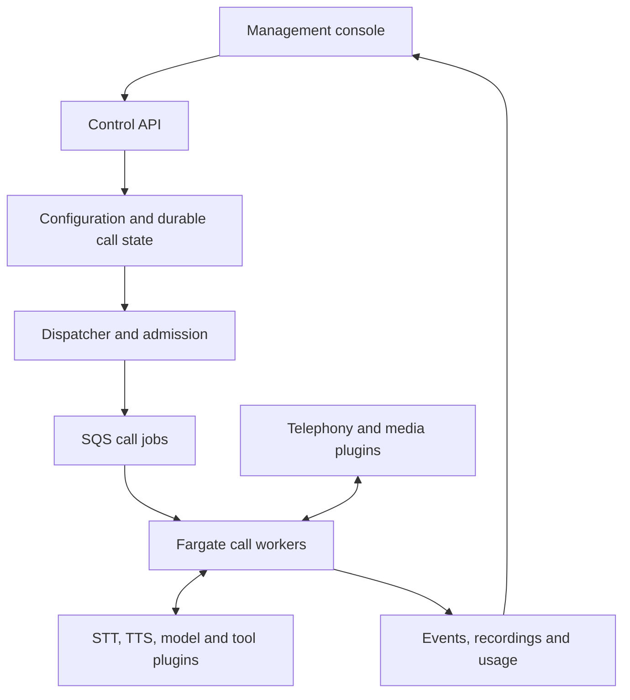

# OVO

### Open Voice Orchestrator

**Build, run, and observe voice agents on your own infrastructure. Everything is a plugin.**

OVO is a TypeScript-first voice-agent platform being developed by [Winsen Labs](https://winsen.ai). It brings conversation orchestration, telephony integrations, agent configuration, and call observability into one self-hostable system.

Start with a message and a few variables. Add approved FAQ answers, a conversational model, or business tools when your use case needs them. Choose the providers behind each capability and manage your agents through a web console.

> **Project status: implementation available; production certification pending.** This repository contains runnable applications, local tests, and deployment profiles. Each self-hosted installation serves one organization. Live carrier/provider certification, AWS deployment measurements, and package publication require separate authorization. Local fixture results do not certify those external systems.

[Documentation](docs/README.md) · [Architecture](docs/04-architecture.md) · [Roadmap](docs/06-engineering-plan.md) · [Build-agent instructions](docs/02-agent-build-guide.md)

## Why OVO?

Operating a voice agent means coordinating audio, conversation state, external services, and business actions in real time. A caller can interrupt while a tool is running. A provider can return audio after a response has been cancelled. A deployment can begin halfway through a call.

OVO is designed to make those interactions explicit, configurable, and observable. Its focus is reliable execution, interchangeable components, and a console that lets an operator understand what happened during a call.

## Everything is a plugin

The conversation engine itself is replaceable. So are the capabilities around it:

- **Conversation:** scripted behavior, FAQ matching, supplied-context dialogue, and tool-using agents.
- **Voice:** speech recognition, synthesis, voice activity detection, turn detection, and playback.
- **Connectivity:** telephony control, media transports, and business integrations.
- **Execution:** model adapters, tool policies, processing speech, and recovery behavior.
- **Operations:** persistence adapters, recordings, secrets, telemetry, evaluations, and cost accounting.
- **Console:** configuration forms and call-inspection extensions.

A small host composes plugins through typed contracts, declared dependencies, and scoped lifecycles. First-party plugins follow the same contracts as external plugins. Active calls pin their configuration and plugin versions.

Plugins are normally composed inside a process; modularity does not require a network hop between every audio-processing stage. Supported combinations must pass conformance tests. See the [plugin-first architecture requirements](docs/08-plugin-first-fargate.md).

## Four ways to build an agent

| Mode                          | Example                                                      | Model requirement                                  |
| ----------------------------- | ------------------------------------------------------------ | -------------------------------------------------- |
| Message with variables        | Read an appointment reminder or account update               | No LLM; STT optional for one-way delivery          |
| Script and FAQ                | Follow an approved script and answer known questions         | Deterministic matching; no LLM required            |
| Supplied-context conversation | Answer questions using the information supplied to the agent | LLM, with bounded context and uncertainty handling |
| Agent with tools              | Check booking availability or update a business system       | LLM plus validated, permission-controlled tools    |

For customer-facing checks, configurable processing speech such as “Please wait while I check that” is enforced by the runtime. Tool execution, spoken acknowledgment, interruption, and result delivery have explicit ordering and state.

## A console for the whole call lifecycle

The console covers agent creation, scripts, knowledge, provider bindings, tools, processing phrases, testing, and versioned releases. Provider credentials use write-only forms and server-side resolution.

Operators can inspect persisted calls, transcripts, recordings, tool outcomes, interruptions, and stage-level latency when the required services are configured. Missing measurements remain unavailable. Cost views separate estimates from reconciled usage. Fixture evaluations do not contact carriers or business systems.

See the [frontend specification](docs/05-frontend.md) and [acceptance criteria](docs/07-acceptance.md).

## Built for ECS Fargate

Fargate is the primary production deployment target. The conversation loop and streaming provider connections live in long-running worker containers. SQS carries call jobs; audio travels over the media connection.



ECS scaling policies adjust worker capacity using demand, occupied slots, warm-capacity targets, and provider quotas. Workers become ready before outbound dialing; inbound service uses warm capacity or an explicit overflow policy. Active calls are protected during ordinary scale-in and drained during deployments.

Fargate reduces host management. Startup time, idle allocation, quotas, and network topology still need to be measured. Managed AWS services and external AI/carrier APIs remain explicit dependencies. A secondary single-EC2 profile uses the same application images for smaller installations.

Read the [Fargate deployment and scaling specification](docs/08-plugin-first-fargate.md).

## Research foundations

OVO directly imports and adapts the [DeepSeek Harness](https://github.com/deepseek-ai/deepseek-harness) plugin foundation, including Cordis composition and lifecycle mechanisms. The repository includes the pinned source, hashes, and license notices. See [the import map](docs/research/deepseek-import-map.md). Voice research compares [Pipecat](https://github.com/pipecat-ai/pipecat) and [LiveKit Agents JS](https://github.com/livekit/agents-js); those comparisons are not claims that either engine runs inside OVO.

LiveKit is not a mandatory dependency. The implementation uses the DeepSeek-derived foundation with Twilio media, Deepgram streaming STT, and OpenAI TTS/inference adapters. Read the [source-reuse mandate](docs/11-deepseek-foundation.md) for import, attribution, and upgrade requirements. The [upstream research assignment](docs/09-upstream-research-assignment.md) defines the comparison evidence.

## Getting started

### Docker Compose quickstart

For a complete single-organization installation on one Docker host:

```sh
git clone https://github.com/winsenlabs/ovo.git
cd ovo
./scripts/bootstrap-compose.sh --prompt-admin
docker compose --env-file infra/compose/.env \
  -f infra/compose/compose.yaml up --build -d --wait
./scripts/verify-compose.sh
```

Open http://localhost:3000 and use the first-administrator email and password entered during bootstrap. The ignored environment file is created with mode `0600`; generated secrets are never printed. Live calls and paid provider evaluation remain disabled.

See the [self-hosted Compose runbook](docs/runbooks/self-hosted-compose.md) for managed PostgreSQL with TLS, local versus production queues, storage, port changes, shutdown and the requirements for enabling real calls. Redis is not required by the current runtime.

### Source development

Use Node.js 22 and pnpm 10. Install the pinned workspace dependencies:

```sh
git clone https://github.com/winsenlabs/ovo.git
cd ovo
pnpm install --frozen-lockfile
./scripts/local-ci.sh
```

1. Follow [local development](docs/local-development.md) to start the API and console.
2. Configure [operators and installed extensions](docs/runbooks/operators-and-extensions.md).
3. Read [backup and restore](docs/runbooks/backup-restore.md) before operating durable installations.
4. Use the [documentation index](docs/README.md) for deployment and acceptance requirements.

Workspace packages use the `@winsendotai/ovo-*` namespace. They are private workspace packages, not published npm releases. Production API startup requires PostgreSQL and a production-safe credential backend. Live dialing stays disabled until the installation explicitly enables it.

## Roadmap

- [ ] Upstream research, comparative prototypes, and architecture decisions.
- [ ] Plugin host, deterministic test harness, and streaming execution.
- [ ] Carrier integration and all four conversation modes.
- [ ] Agent studio, provider credentials, and versioned releases.
- [ ] Call inspector, evaluations, recordings, and cost reporting.
- [ ] Fargate autoscaling, failure recovery, and production certification.

The [engineering plan](docs/06-engineering-plan.md) breaks this into 20 work packages. Completion is assessed against [75 acceptance criteria](docs/07-acceptance.md); performance targets are not claims of achieved results.

## Contributing

Research findings, reproducible voice scenarios, architecture feedback, and implementation contributions are welcome. [Open an issue](https://github.com/winsenlabs/ovo/issues) to discuss a proposed change or missing capability.

Before implementing, read the [agent and contributor build guide](docs/02-agent-build-guide.md) and identify the relevant work package. Keep changes focused, document provider limitations, and include evidence for behavioral claims. Use synthetic data and owned test numbers; never commit credentials or customer recordings.

## License

OVO is intended to be released as open source. A project license has not yet been selected or added to this repository. Public source availability alone does not grant an open-source license; licensing must be resolved before a software release.

## Implementation and local development

Implementation now lives in the private `@winsendotai/ovo-*` workspace. See [local development](docs/local-development.md) to run the persisted API and management console or execute CI locally. GitHub Actions are suspended.

The [PM task board](PM/README.md) tracks the complete W01–W20 work breakdown. The [acceptance ledger](PM/acceptance.md) retains all 75 launch requirements. [Progress](docs/progress.md) distinguishes source inspection, working local fixtures, simulations and unverified production integrations. This branch is not a production launch certification.
