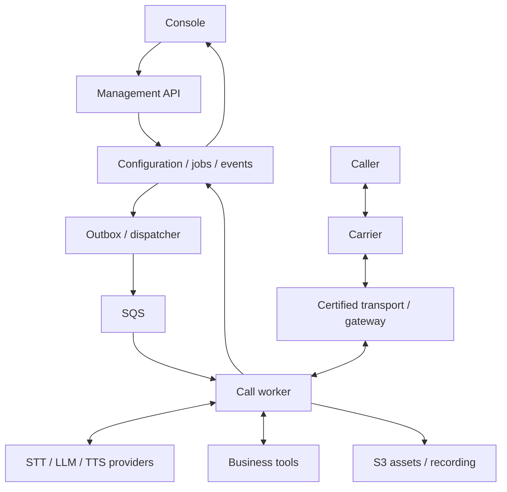

# Architecture and implementation contracts

## 1. Deployment and ownership

Deploy the same application images/configuration schema in two profiles. Fargate: separate services for API/console/dispatcher, a worker pool, media gateway if needed, and postprocessing. Single EC2: containers for the same responsibilities with explicit resource limits; at least two independent call workers. Managed SQS/S3/database/Secrets Manager may remain external in both profiles. Single EC2 is not highly available.

Each worker initially admits one active call. A worker is reusable after verified cleanup; it is not permanently tied to an agent definition. A session pins agent, behavior, plugin, FAQ/context, price-card and policy versions. Agent definitions are not separate ECS services.

LiveKit is optional. If selected, its SDK lives in the worker; its media/SIP/egress infrastructure is separate shared infrastructure. A direct carrier WebSocket transport avoids requiring that media server but still needs call routing, playback clearing and carrier control. Never assume an arbitrary load balancer will reconnect a carrier to the worker holding its state. Implement a session-aware gateway/router or prove a provider-supported routing scheme.

SQS coordinates work; audio is continuous over the media connection. Shared inference endpoints accept concurrent requests; no single FIFO queue serializes all callers' turns.

## 2. Plugin manifest and host

A plugin declares ID, version, compatible contract versions, service dependencies, provided capabilities, supported engine/transport combinations, config schema, secret-reference fields, UI schema/panels, health checks and cleanup. Optional integrations are distinguishable from required dependencies. Configuration cannot override platform security constraints.

Lifecycle: validated → dependency-ready → initializing → active → draining → disposed; failure is explicit. Reject missing/ambiguous exclusive providers, incompatible versions and dependency cycles before activation. Cleanup runs once despite concurrent cancel/shutdown calls. Active sessions retain pinned plugins; upgrades affect new calls.

Process scope owns shared clients and bounded caches. Session scope owns media, transcript, response state, timers, operations, private data and cleanup. Call-scoped providers are isolated even if their underlying API client is pooled.

Trusted plugins execute application code and require operator-approved artifacts. “Plugin” does not imply sandbox security. Launch supports reviewed built-in UI components and schema-generated forms, not arbitrary remote scripts.

## 3. Frame execution contracts

Define a minimal discriminated union rather than importing every upstream frame type. Required categories: inbound/outbound audio, transcript hypothesis/accepted text, speech-start/turn-end, response text, synthesis segment, operation request/result, playback evidence, interruption, error and shutdown. Include session ID, response epoch where relevant, correlation IDs, monotonic timestamp and payload schema version.

Separate urgent lifecycle/interruption processing from ordered output work. Preserve order within lanes. Cancellation must not be delayed behind accumulated audio; scheduling must also prevent indefinite starvation of normal work. A priority queue without fairness and resource bounds is insufficient.

Use cooperative cancellation signals plus epoch checks before every output enqueue/write. Cancelling a promise does not undo a provider request. Every adapter declares cancellation support, reconnect behavior, output flush capability and playback evidence quality.

Bound buffers in audio milliseconds/bytes and text segments. Record overflow. Define whether to drop obsolete response output, backpressure the producer, or end the session; never silently drop critical business results. CPU-heavy resampling/inference must not block urgent events on the main event loop.

Only the playback owner sends speech. Cached greetings, acknowledgments, tool results, FAQ answers and model speech enter the same queue. Segments track generated → queued → sent → acknowledged/estimated → completed/interrupted. Evidence does not prove human hearing. Conversation context includes accepted caller input, confirmed tool results and delivered/estimated speech with interruption markers, not the full abandoned draft.

## 4. Behavior contract

A behavior receives accepted user input, state, available capabilities and operation results; emits speak, request-operation, ask-confirmation, transition, transfer or end actions. It never calls carrier/model SDKs directly or writes raw audio. State transitions are validated, bounded and inspectable.

Announcement: validate/render templates, optional fixed branches. FAQ: match approved entries, clarify, resume state. Context: assemble supplied facts with bounded model requests. Agent: bounded model/tool continuation with approved tools only. Realtime speech-to-speech is a later engine capability; do not force its semantics into the first text-mediated pipeline.

## 5. Operation and acknowledgment state machine

Operation states: proposed → authorized → awaiting-confirmation when required → intent-persisted → running → succeeded/failed/unknown → reconciled. Acknowledgment states: required → queued → playing → completed/interrupted. These are independent; a tool can finish before speech does.

Order:

1. Validate permissions, schemas, verified-caller state and business policy.
2. Request caller confirmation if needed; never confuse acknowledgment with consent.
3. Persist intent for side effects and resolve acknowledgment policy/version.
4. Atomically coordinate one acknowledgment request per logical operation and start the allowed tool without waiting for the phrase to finish.
5. Persist result. Queue response after acknowledgment unless superseded by current user turn.
6. On interruption, stop speech and reconsider response. Preserve settled result and reconcile uncertain side effects.

Group internal reads under one user-facing check. Retries keep the operation ID. Progress updates are bounded, cancellable and suppressed after settlement. Missing acknowledgment configuration blocks release. A policy-denied tool does not say “I'm checking” and then silently do nothing.

Tool contracts declare schema, side-effect class, required authorization, confirmation, deadline, safe retries, idempotency key mapping, status query/reconciliation, cancellation semantics, redaction and acknowledgment key. HTTP connectors also declare endpoint/verb, approved dynamic paths, headers/auth mapping and output projection. Protect against SSRF, redirects to private metadata endpoints and arbitrary input-derived destinations.

## 6. Durable records and scheduling

Records: workspace, agent draft, immutable release, provider binding, credential reference, FAQ/context version, campaign, job/attempt, call/session/leg, operation, event, artifact, evaluation, usage entry, audit entry. External customer IDs label usage but never confer access.

Events include schema version, unique event ID, session sequence, ownership epoch, event/ingest timestamps, turn/response/operation IDs and redacted payload. Raw audio/token deltas are transient unless specifically captured; durable facts include accepted text, tool intent/results, state and playback settlements. Derive projections for UI/search; consumers are idempotent and can rebuild.

Outbound job creation uses a transactional job+outbox design. Publisher sends references to SQS. Worker claims through conditional durable ownership with heartbeat/epoch. Dial waits for media/provider readiness. Persist carrier request IDs. If dial timed out after acceptance, reconcile before redial. SQS duplicate delivery must not duplicate calls.

Maintain attempt history; retry policy checks current time window, suppression, maximum attempts and budget. Connected-call failure does not automatically authorize redial. Queued cancellations race safely with dial submission. Unknown outcomes remain visible. DLQ/redrive retains IDs and revalidates eligibility.

Inbound admission needs ready capacity or explicit wait/busy/human/callback behavior. Do not silently cold-start after accepting a call and leave unexplained silence. Warm capacity is a visible cost choice.

Drain stops admission before shutdown. Protect active Fargate service tasks against ordinary scale-in where supported; this is not crash protection. EC2 workers have resource limits but share a host failure domain. A durable log does not guarantee live-audio recovery.

## 7. API contracts

Implement versioned routes with OpenAPI and generated clients. Suggested resources: `/v1/agents`, `/versions`, `/provider-bindings`, `/credentials`, `/faqs`, `/context-assets`, `/tools`, `/calls`, `/campaigns`, `/evaluations`, `/metrics`, `/artifacts`, `/audit`. Commands are explicit under a resource, e.g. publish, pause, transfer, end. Reads are paginated and scoped server-side.

All mutations validate permission and schema. Draft updates use optimistic concurrency; stale edits produce conflict with a diff/reload path. Call submission and operational commands support scoped idempotency. Long actions return operation IDs and status. Live events resume from a cursor or consistent snapshot; stale cursor is explicit. Signed callbacks/webhooks use replay protection and deduplication.

Secret creation accepts plaintext only over authenticated TLS, sends it directly to the secret backend, and returns metadata/reference. No ordinary GET returns its value. Validation jobs retrieve the secret server-side. See frontend specification for rotation and retirement.

## 8. Cost, retention and observability

Track provider-native billable units and request IDs with versioned price cards; mark estimated/reconciled charges. Include failed attempts, carrier legs, STT, TTS, LLM/cache, worker startup/idle/billing minimums, media, network, recording and shared services. Keep marginal and allocated cost separate. Use fixed-precision money and explicit FX version; show INR and paise. Cached speech still consumes call/media time.

Correlate every span with call/turn/response/operation/plugin/worker IDs. Use monotonic elapsed time and synchronized wall time; do not add overlapping spans to claim total latency. Capture real first meaningful response separately from filler. Dashboard/analytics failure cannot block audio; bounded export buffers expose dropped telemetry.

Recording is policy-controlled and has starting/active/paused/finalizing/available/failed/expired states. Store timestamp alignment, channels, codec, checksum and evidence source. Access is permission-scoped through expiring links. Retention must cover recordings, transcripts, events, derived indexes, caches, exports and backup behavior. Replay defaults to stub tools and never contacts a real customer.
