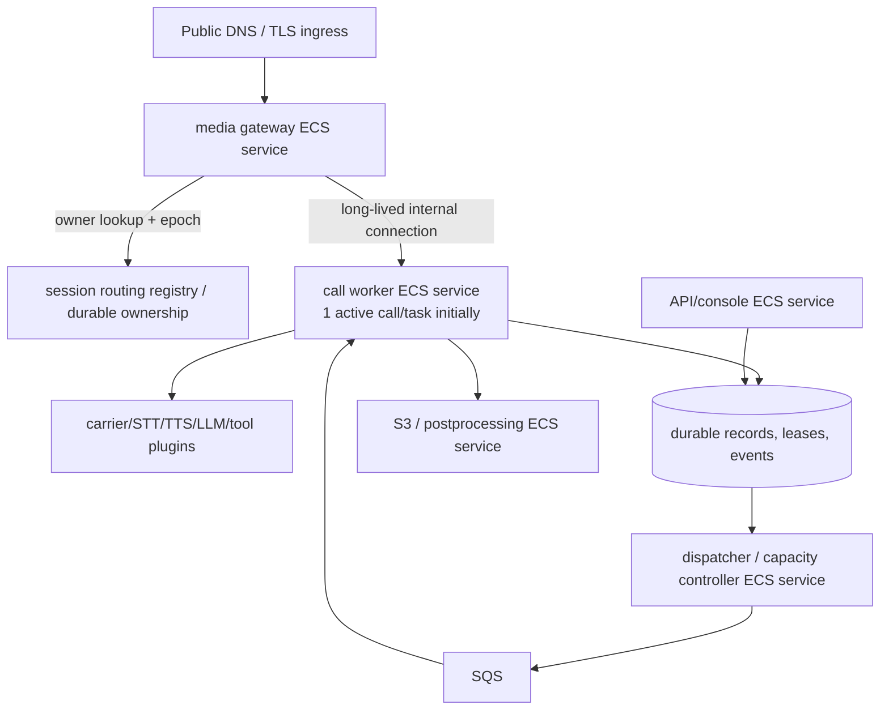

# Deployment feasibility: Fargate direct-media profile

**Research date:** 2026-09-20  
**Status:** architecture and official-documentation assessment only. No AWS deployment, credentials, carrier call, load test, or paid action was performed. This document is a practical implementation plan, not an operational certification.

## Recommendation

Proceed with a **direct carrier WebSocket profile** as the first Fargate-compatible topology:

- separate ECS/Fargate services for control API/console, dispatcher/capacity controller, media gateway, one-slot call workers, and postprocessing;
- carrier WebSockets terminate at the media gateway; a session-aware internal router connects each socket to the worker that owns its durable session lease;
- SQS supplies durable job references through a transactional outbox, never audio;
- retain a warm inbound floor and reserve a ready protected worker **before** streaming/dial admission;
- make one component the authoritative desired-count writer per ECS service.

This satisfies the product’s separation-of-concerns direction in `docs/04-architecture.md` and `docs/08-plugin-first-fargate.md`. It is credible but **not yet proven** for OVO’s carrier, target region, call volume, reconnection path, or drain behavior.

## Feasibility assessment

| Requirement                                       | Documentation evidence                                                                                                                                                                                                                                                      | Assessment                                                         | Required implementation / proof                                                                                                                                                              |
| ------------------------------------------------- | --------------------------------------------------------------------------------------------------------------------------------------------------------------------------------------------------------------------------------------------------------------------------- | ------------------------------------------------------------------ | -------------------------------------------------------------------------------------------------------------------------------------------------------------------------------------------- |
| Run OVO application containers on Fargate         | Fargate supports ECS tasks/services with `awsvpc` networking; Fargate service load balancers use `ip` targets. [AWS Fargate task networking](https://docs.aws.amazon.com/AmazonECS/latest/developerguide/fargate-task-networking.html)                                      | **Feasible, documented.**                                          | Build the same images/config schema for Fargate and compact EC2 profile. Keep carrier/media SDKs in plugins.                                                                                 |
| Receive carrier WebSocket traffic                 | ALB supports Fargate `ip` targets. ALB idle timeout is explicit/configurable (default 60s; 1–4,000s). [ALB attributes](https://docs.aws.amazon.com/elasticloadbalancing/latest/application/edit-load-balancer-attributes.html)                                              | **Feasible as ingress, not sufficient as routing proof.**          | TLS terminates at a public ingress; gateway tasks are targets. Set/tune timeout and test quiet-call behavior.                                                                                |
| Keep a call on its owning worker                  | AWS networking gives each Fargate task an ENI, but neither ECS nor a generic load balancer supplies OVO’s durable session ownership/reconnect protocol. [Fargate task networking](https://docs.aws.amazon.com/AmazonECS/latest/developerguide/fargate-task-networking.html) | **Adaptation required.**                                           | Gateway resolves durable owner + epoch and maintains a per-connection internal route. Do not infer affinity/recovery from ALB behavior.                                                      |
| Perform low-latency audio and interruption        | A direct bidirectional Twilio stream supports `media`, `mark`, and `clear`. [Twilio WebSocket messages](https://www.twilio.com/docs/voice/media-streams/websocket-messages)                                                                                                 | **Feasible candidate.**                                            | Media is continuous gateway↔worker traffic; implement a bounded urgent lane and one playback owner. Carrier test required.                                                                   |
| Durable job orchestration                         | SQS standard queues are at-least-once, with a temporary visibility timeout. [SQS visibility timeout](https://docs.aws.amazon.com/AWSSimpleQueueService/latest/SQSDeveloperGuide/sqs-visibility-timeout.html)                                                                | **Feasible with idempotency, not exactly-once.**                   | Transactional job/outbox; conditional ownership/epoch; visibility and lease heartbeats; persisted provider request IDs; reconcile unknown dial/tool outcomes.                                |
| Scale ECS services                                | ECS Service Auto Scaling adjusts desired task count using Application Auto Scaling. [ECS Service Auto Scaling](https://docs.aws.amazon.com/AmazonECS/latest/developerguide/service-auto-scaling.html)                                                                       | **Feasible, configuration-sensitive.**                             | One scaling authority per service. Instrument ready/reserved/active/draining state; do not scale from raw SQS depth alone.                                                                   |
| Preserve active sessions during ordinary scale-in | ECS task scale-in protection protects service tasks from scale-in and expires unless renewed. [Task scale-in protection](https://docs.aws.amazon.com/AmazonECS/latest/developerguide/task-scale-in-protection.html)                                                         | **Feasible for ordinary scale-in; incomplete failure protection.** | Set/renew protection before admission; deny admission on failure; release after call cleanup. Treat task crashes, capacity interruption, and hard drain deadline as explicit fallback cases. |
| Low-latency inbound calling                       | Fargate task startup is not a carrier wait-room guarantee; ECS scaling is asynchronous. The specs require warm capacity.                                                                                                                                                    | **Requires warm capacity or explicit overflow.**                   | Publish and enforce an inbound warm floor. Never return `<Connect><Stream>`/dial before a protected worker is ready. Measure cold and warm admission.                                        |

## Proposed topology and ownership flow

### Admission protocol

1. Dispatcher/capacity controller computes candidate capacity from **fresh** ready-idle, reserved, active, starting, and draining counts; counts are mutually exclusive.
2. It conditionally reserves a ready worker and writes a session ownership epoch. The worker verifies readiness and successfully establishes ECS scale-in protection before the reservation is usable.
3. For outbound work, only then submit the carrier dial and persist its request ID. For inbound work, only then return stream-connecting call instructions; otherwise execute the selected busy/wait/callback/human fallback.
4. Gateway verifies carrier authenticity, binds call/stream identifiers to the durable session and owner epoch, then opens the internal route to that owner. A stale or duplicate connection cannot take ownership.
5. Worker heartbeat renews both durable ownership and, where used, SQS visibility/protection. On completion it durably settles outcomes, performs bounded cleanup once, releases protection/reservation, and becomes reusable.

### Why SQS is deliberately off the media path

SQS offers at-least-once delivery and visibility control, which fits dispatch/retry/reconciliation but does not preserve a single continuous audio connection or playback timing. The worker’s direct media route must carry audio, interruption, and playback acknowledgments. Persist only the durable facts required by the architecture: accepted text, operation intent/results, state transitions, and delivery/interrupt evidence.

## Scaling: one authoritative path

Choose and document one of these patterns **per ECS service**:

| Pattern                       | Writer of desired count                                                                                  | When practical                                             | Constraint                                                                 |
| ----------------------------- | -------------------------------------------------------------------------------------------------------- | ---------------------------------------------------------- | -------------------------------------------------------------------------- |
| A. Fenced capacity controller | Dispatcher/capacity controller, holding a durable leader lease, writes desired count                     | Admission/reservation state is the primary signal          | Do not also enable target-tracking/step policies that write desired count. |
| B. Application Auto Scaling   | Application Auto Scaling policy adjusts desired count from a published absolute required-capacity metric | The metric and policy behavior are fully observable/tested | Custom code publishes metrics only; it does not change desired count.      |

For initial OVO work, prefer **Pattern A** because admission is based on conditional reservations and warm inbound capacity, not just CPU or approximate queue depth. This is a recommendation, not an AWS capability claim. It needs a small, fenced controller with audit events and strict rate/hysteresis limits.

Suggested one-slot planning equation from the binding spec:

`required = active + reserved + min(eligibleUnclaimed, permittedNewStartsInHorizon) + warmIdleTarget`

Clamp to allowed capacity and provider budgets. Count starting tasks as provisioned once, avoid repeated scale-out on stale readings, scale out in bounded steps, and scale in slower than scale out. CPU/memory/event-loop lag and provider failures are health constraints, not proof a worker is free.

## Warm inbound policy

A zero-worker service can be appropriate for scheduled outbound work only if the control service remains available to signal demand and startup delay is acceptable. It is unsuitable for low-latency inbound voice unless the product supplies an explicit wait/busy/callback/human route.

Implement the inbound floor as a visible per-region configuration constrained by platform maximums. Required evidence before setting it: measured p50/p95/p99 time from desired-count change to worker **ready**, gateway routing readiness, credential/media initialization, and carrier answer-to-first-meaningful-audio. Report idle task cost separately from connected-call cost.

## Drain and task protection

Task protection is useful but narrow: it prevents ordinary ECS service scale-in selection, can expire, and must be renewed. It does not preserve call state through crashes, process faults, carrier disconnects, or every infrastructure termination source. [AWS task scale-in protection](https://docs.aws.amazon.com/AmazonECS/latest/developerguide/task-scale-in-protection.html)

Implement this ordered drain protocol:

1. Mark gateway/worker draining; gateway stops assigning new sessions.
2. Worker rejects new reservations, maintains existing media, and renews protection/lease only while active.
3. Deregister ingress targets according to tested connection behavior; do not assume deregistration magically migrates a WebSocket.
4. Let calls settle or reach the explicit product fallback deadline. Persist outcome/reconciliation state.
5. Run idempotent cleanup, release protection and reservation, then stop the task.

Test normal rollout, scale-in, protection renewal failure, stale owner epoch, worker crash, gateway crash, and carrier reconnect separately. A short process shutdown window is not a promise to preserve an arbitrary-length call.

## Implementation gates and acceptance evidence

| Gate                | Pass evidence                                                                                                                               | Current status |
| ------------------- | ------------------------------------------------------------------------------------------------------------------------------------------- | -------------- |
| Gateway routing     | Two gateway tasks route initial and reconnect scenarios to the durable owning worker; stale epochs rejected                                 | **Unverified** |
| Carrier media       | Owned number validates µ-law stream, mark/clear interruption, callbacks, and call control needed for launch                                 | **Unverified** |
| Warm admission      | Measured cold/warm start distributions; reserved worker produces greeting inside product target                                             | **Unverified** |
| Worker drain        | Protected rollout leaves active call functioning under documented conditions; new sessions use new release                                  | **Unverified** |
| Failure recovery    | Worker/gateway/carrier loss produces persisted, visible reconciliation rather than silent redial or duplicate side effects                  | **Unverified** |
| Scaling correctness | Burst, stale metric, queue-empty/active-call, quota, zero-to-demand, and return-to-zero drills show one writer and no over-admission        | **Unverified** |
| Security            | Carrier signature validation through production proxy path, least-privilege task roles, secret redaction, and internal route authentication | **Unverified** |

## Independent implementation checklist

- [ ] Define plugin contracts for media transport, telephony control, durable queue/store, capacity policy, and operations; adapters own AWS/Twilio SDK imports.
- [ ] Implement transactional job/outbox plus conditional call ownership epoch before any carrier retry path.
- [ ] Implement media gateway routing and bounded gateway↔worker protocol before adding inference providers.
- [ ] Make worker readiness include plugin initialization, connectivity checks, routing registration, and successful protection setup.
- [ ] Add one desired-count writer and audit each scale decision with inputs, freshness, clamp, and result.
- [ ] Set a warm inbound floor and explicit overload fallback; keep it in the same capacity authority as scheduled prewarming.
- [ ] Automate the listed drills with fixture carrier transport first, then an authorized owned-number/Fargate environment.

## Sources

- [AWS: Fargate task networking](https://docs.aws.amazon.com/AmazonECS/latest/developerguide/fargate-task-networking.html)
- [AWS: ECS Service Auto Scaling](https://docs.aws.amazon.com/AmazonECS/latest/developerguide/service-auto-scaling.html)
- [AWS: ECS task scale-in protection](https://docs.aws.amazon.com/AmazonECS/latest/developerguide/task-scale-in-protection.html)
- [AWS: SQS visibility timeout](https://docs.aws.amazon.com/AWSSimpleQueueService/latest/SQSDeveloperGuide/sqs-visibility-timeout.html)
- [AWS: ALB attributes and idle timeout](https://docs.aws.amazon.com/elasticloadbalancing/latest/application/edit-load-balancer-attributes.html)
- [Twilio: Media Streams](https://www.twilio.com/docs/voice/media-streams)
- [Twilio: Media Stream WebSocket messages](https://www.twilio.com/docs/voice/media-streams/websocket-messages)
