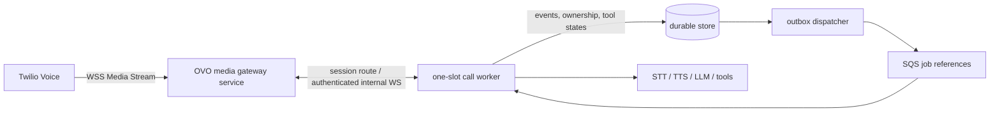

# Provider capabilities: Twilio Media Streams and AWS primitives

**Research date:** 2026-09-20  
**Status:** desk research only. No account access, carrier calls, credentials, paid actions, or owned-number testing occurred. “Verified” below means documented by the provider, not certified for OVO.

## Decision boundary

The practical first carrier candidate is **Twilio Programmable Voice with bidirectional Media Streams**. It can supply OVO’s direct carrier WebSocket path without a LiveKit media server, but it does **not** eliminate a session-aware media gateway. Treat Twilio as a candidate binding, not the certified provider matrix required by `docs/04-architecture.md`.

## Capability matrix

| OVO need                                   | Provider evidence                                                                                                                                                                                                                                                                                                 | OVO status and implementation consequence                                                                                                                                                                                                                                                      |
| ------------------------------------------ | ----------------------------------------------------------------------------------------------------------------------------------------------------------------------------------------------------------------------------------------------------------------------------------------------------------------- | ---------------------------------------------------------------------------------------------------------------------------------------------------------------------------------------------------------------------------------------------------------------------------------------------- |
| Direct bidirectional WebSocket audio       | `<Connect><Stream>` creates a bidirectional Media Stream. The application receives inbound-call audio and may send `media`, `mark`, and `clear` messages. [Twilio Media Streams](https://www.twilio.com/docs/voice/media-streams), [messages](https://www.twilio.com/docs/voice/media-streams/websocket-messages) | **Verified documented.** Implement a Twilio transport plugin and a public `wss` gateway; do not route each message through SQS.                                                                                                                                                                |
| Audio codec                                | Twilio documents bidirectional outbound audio as base64 `audio/x-mulaw`, 8 kHz; the WebSocket `start` metadata identifies stream format. [WebSocket messages](https://www.twilio.com/docs/voice/media-streams/websocket-messages)                                                                                 | **Verified documented.** Make µ-law/8 kHz conversion explicit at the adapter boundary; benchmark STT/TTS resampling and prohibit raw audio/binary WebSocket output.                                                                                                                            |
| Single transport ownership                 | Twilio permits one bidirectional stream per call and only the inbound track is available for that stream. [Media Streams](https://www.twilio.com/docs/voice/media-streams)                                                                                                                                        | **Verified documented.** One OVO session owns one carrier stream and one playback owner. Do not design for separate inbound/outbound carrier tracks in this topology.                                                                                                                          |
| Interrupting queued speech                 | `clear` empties buffered audio; Twilio returns pending `mark` events. A `mark` sent after media is echoed when playback completes. [WebSocket messages](https://www.twilio.com/docs/voice/media-streams/websocket-messages)                                                                                       | **Verified documented.** Map `mark` to delivery evidence, not proof the human heard it. Correlate mark name, response epoch, stream SID, and output segment. On barge-in: increment epoch, stop local enqueue, send `clear`, and mark returned/remaining segments interrupted.                 |
| Carrier call control                       | The Voice API creates outbound calls, and its Calls resource supports updating an in-progress call (including TwiML redirect/status). [Call resource](https://www.twilio.com/docs/voice/api/call-resource)                                                                                                        | **Adaptation required.** Isolate dial, hangup, redirect/transfer policy, status callbacks, and reconciliation in a telephony-control plugin. Verify the exact transfer product/behavior required by OVO before advertising transfer.                                                           |
| Inbound start / outbound start             | TwiML `<Stream>` supports Media Streams and `<Connect>` blocks subsequent TwiML until the stream disconnects. [Stream TwiML](https://www.twilio.com/docs/voice/twiml/stream)                                                                                                                                      | **Verified documented.** Route inbound webhooks to an admission decision before returning stream TwiML. For outbound, reserve a ready worker before creating the call; reconcile a timeout against Twilio’s call SID before any retry.                                                         |
| Origin authentication                      | Twilio instructs Media Stream applications to validate `X-Twilio-Signature`. [Media Streams](https://www.twilio.com/docs/voice/media-streams)                                                                                                                                                                     | **Verified documented.** Validate the signature and expected host/path before accepting a stream; also bind `CallSid`/`StreamSid` to the durable session and reject replay/duplicate connection attempts. The concrete Node validation library/version remains an implementation choice.       |
| Callback authenticity / dedupe             | Twilio signs webhook requests and provides request-validation guidance. [Webhook security](https://www.twilio.com/docs/usage/security#validating-requests)                                                                                                                                                        | **Verified documented.** Verify every status callback, persist provider event IDs/semantic dedupe keys, and make transitions idempotent. A valid signature is not duplicate protection.                                                                                                        |
| Regional/onboarding/throughput suitability | Twilio’s published limits and account/number availability vary by product, country, account, and configuration. [Voice limitations](https://www.twilio.com/docs/voice/limitations-and-edge-cases)                                                                                                                 | **Unknown / release gate.** Confirm target-country number availability, regulatory onboarding, geographic media edge, concurrent-call/CPS limits, transfer behavior, and pricing with the intended account before selecting the production carrier. No desk-source claim substitutes for this. |
| Durable job delivery                       | SQS standard queues are at-least-once; visibility timeout does not eliminate duplicates. [SQS visibility timeout](https://docs.aws.amazon.com/AWSSimpleQueueService/latest/SQSDeveloperGuide/sqs-visibility-timeout.html)                                                                                         | **Verified documented.** SQS carries job references only. Use transactional job+outbox, conditional durable call ownership, idempotency keys, heartbeats/visibility extension, and reconciliation; do not put audio frames on SQS.                                                             |
| Task networking                            | Fargate tasks use `awsvpc`; each task has an ENI. Fargate services behind ALB/NLB require `ip` target groups. [Fargate task networking](https://docs.aws.amazon.com/AmazonECS/latest/developerguide/fargate-task-networking.html)                                                                                 | **Verified documented.** Put gateway and workers in private subnets; terminate public TLS at an ALB (or other explicitly tested ingress) and use `ip` targets. The gateway, not the load balancer, holds routing ownership.                                                                    |
| Long-lived WebSocket ingress               | ALB idle timeout defaults to 60 seconds and is configurable from 1–4,000 seconds. [ALB attributes](https://docs.aws.amazon.com/elasticloadbalancing/latest/application/edit-load-balancer-attributes.html)                                                                                                        | **Verified documented.** Set an explicit timeout and send/test application traffic appropriate to it. This does not prove reconnection affinity, draining semantics, or carrier retry behavior.                                                                                                |
| Active-task scale-in protection            | ECS task scale-in protection prevents service tasks from being selected for ordinary scale-in; protection expires and can be renewed. [ECS task scale-in protection](https://docs.aws.amazon.com/AmazonECS/latest/developerguide/task-scale-in-protection.html)                                                   | **Verified documented.** Worker obtains/renews protection before admission, and blocks admission when protection cannot be established. Protection is not crash survival or permanent connection preservation.                                                                                 |
| ECS scaling                                | ECS Service Auto Scaling uses Application Auto Scaling to adjust service desired count. [ECS service auto scaling](https://docs.aws.amazon.com/AmazonECS/latest/developerguide/service-auto-scaling.html)                                                                                                         | **Verified documented.** Pick exactly one desired-count writer: a fenced capacity controller _or_ Application Auto Scaling policies. Scheduled prewarm feeds that same authority.                                                                                                              |

## Recommended direct-WebSocket topology

1. The public gateway authenticates Twilio’s request, accepts the carrier socket, derives a session key from call/stream identifiers, and routes the **connection** to the worker holding the matching durable ownership epoch.
2. The worker is reserved, ready, and protected before an inbound call receives streaming TwiML or before an outbound dial begins. It owns turn execution and all `media`/`mark`/`clear` decisions.
3. Keep gateway-to-worker routing connection-aware. An ALB may select a target for an initial WebSocket upgrade, but it is not evidence that a later connection/reconnect reaches the state-owning worker. On a fresh connection, consult durable ownership and either route to the owner or execute the documented recovery/fallback.
4. Keep SQS out of the audio path. It launches/retries durable work; it cannot provide continuous audio ordering, low-latency interruption, or WebSocket affinity.

## Open certification gates

These gates intentionally remain **unverified** until an authorized test environment exists:

1. **Carrier:** owned target-market number; inbound and outbound call; signature validation; 8 kHz audio; `mark` completion; `clear` during playback; reconnect/stop behavior; status callback order and dedupe; transfer/handoff; CPS/concurrency limits; account/regulatory readiness.
2. **Fargate routing:** two gateway tasks and multiple one-slot workers; initial connection and reconnection route to the durable owner; gateway and worker loss behavior; no state leak across sessions.
3. **Drain:** stop new admission, deregister gateway targets, retain established sessions where documented, protect active worker tasks, renew protection, then settle or apply explicit fallback. Test rollout and protection-expiry paths.
4. **Security:** real signature verification over the exact public URL/proxy configuration, stream/session binding, replay protection, least-privilege task roles, and no carrier credentials in logs/events.
5. **Capacity:** measure task startup percentile, ready-warm floor cost, concurrent calls per task (initially exactly one), media/inference quota behavior, and admission latency. No published provider limit is an OVO capacity result.

## Practical implementation sequence

1. Define `MediaTransport` and `TelephonyControl` contracts with codec, cancellation, flush, playback-evidence, callback, reconnect, and transfer capability declarations.
2. Implement Twilio adapters behind those contracts; keep Twilio SDK/TwiML types out of behavior and engine packages.
3. Build the gateway/worker ownership handshake before production dialing. Persist worker ID, ownership epoch, call SID, stream SID, and route generation.
4. Add an explicit admission policy: `ready + protected + reserved` capacity is required before accepting a stream/dial; otherwise return configured busy/wait/callback/human behavior.
5. Run the certification gates, publish raw fixture evidence, then mark the supported carrier/region/transfer matrix. Until then, present direct Twilio WebSocket support as a design candidate only.
