<!-- Vendored input fixture for scripts/flow-import: credit3-collections-poc docs/conversation-map.md as of 2026-09-30 (sha256 83f925371c83d0b8a8f94d19fd278bc1ebf5be23bdae20b8885ee46c8a68f753), formatted by prettier and otherwise unchanged. -->

# Conversation map

Generated by `npm run map` from `lib/flow.js`. G = generic clip (pre-rendered at boot), V = variable clip (pre-rendered per call at dial).
Every listening state also accepts the global intents: repeat, human_agent, stop_calling, abusive. Anything else goes to the LLM fallback, which resumes at a listening state.

```mermaid
flowchart TD
  greet["greet<br/><small>GV</small>"]
  greet -- "confirmed" --> disclose
  greet -- "wrong_person" --> wrong_person
  greet -- "third_party" --> third_party
  greet -- "busy" --> busy
  greet -- "asks_purpose" --> reassure
  greet -. "other / low confidence" .-> LLM(("LLM fallback"))
  reassure["reassure<br/><small>V</small>"]
  reassure -- "confirmed" --> disclose
  reassure -- "wrong_person" --> wrong_person
  reassure -- "third_party" --> third_party
  reassure -- "busy" --> busy
  reassure -- "asks_purpose" --> reassure
  reassure -. "other / low confidence" .-> LLM(("LLM fallback"))
  disclose["disclose<br/><small>GVVG</small>"]
  disclose -- "pay_now" --> pay_now
  disclose -- "promise_to_pay" --> ptp_today
  disclose -- "promise_to_pay" --> ptp_tomorrow
  disclose -- "promise_to_pay" --> ptp_3days
  disclose -- "promise_to_pay" --> ptp_week
  disclose -- "promise_to_pay" --> ptp_later
  disclose -- "promise_to_pay" --> ptp_ask
  disclose -- "already_paid" --> already_paid
  disclose -- "cannot_pay" --> hardship
  disclose -- "dispute" --> dispute
  disclose -- "waiver_request" --> waiver
  disclose -- "mandate_help" --> mandate_fix
  disclose -- "busy" --> busy
  disclose -. "other / low confidence" .-> LLM(("LLM fallback"))
  pay_now["pay_now<br/><small>GG · SMS:full</small>"]
  pay_now -- "received" --> pay_close
  pay_now -- "not_received" --> resend
  pay_now -. "other / low confidence" .-> LLM(("LLM fallback"))
  resend["resend<br/><small>G · SMS:full</small>"]
  resend -- "received" --> pay_close
  resend -- "not_received" --> resend
  resend -. "other / low confidence" .-> LLM(("LLM fallback"))
  pay_close["pay_close<br/><small>VG</small>"]
  pay_close -- "no_more" --> goodbye
  pay_close -. "other / low confidence" .-> LLM(("LLM fallback"))
  ptp_today["ptp_today<br/><small>VGG · SMS:full</small>"]
  ptp_today -- "no_more" --> goodbye
  ptp_today -. "other / low confidence" .-> LLM(("LLM fallback"))
  ptp_tomorrow["ptp_tomorrow<br/><small>VGG · SMS:full</small>"]
  ptp_tomorrow -- "no_more" --> goodbye
  ptp_tomorrow -. "other / low confidence" .-> LLM(("LLM fallback"))
  ptp_3days["ptp_3days<br/><small>VGG · SMS:full</small>"]
  ptp_3days -- "no_more" --> goodbye
  ptp_3days -. "other / low confidence" .-> LLM(("LLM fallback"))
  ptp_week["ptp_week<br/><small>VGG · SMS:full</small>"]
  ptp_week -- "no_more" --> goodbye
  ptp_week -. "other / low confidence" .-> LLM(("LLM fallback"))
  ptp_later["ptp_later<br/><small>V</small>"]
  ptp_later -- "yes" --> ptp_week
  ptp_later -- "no" --> hardship
  ptp_later -. "other / low confidence" .-> LLM(("LLM fallback"))
  ptp_ask["ptp_ask<br/><small>G</small>"]
  ptp_ask -- "pay_now" --> pay_now
  ptp_ask -- "promise_to_pay" --> ptp_today
  ptp_ask -- "promise_to_pay" --> ptp_tomorrow
  ptp_ask -- "promise_to_pay" --> ptp_3days
  ptp_ask -- "promise_to_pay" --> ptp_week
  ptp_ask -- "promise_to_pay" --> ptp_later
  ptp_ask -- "promise_to_pay" --> ptp_ask
  ptp_ask -- "already_paid" --> already_paid
  ptp_ask -- "cannot_pay" --> hardship
  ptp_ask -- "dispute" --> dispute
  ptp_ask -- "waiver_request" --> waiver
  ptp_ask -- "mandate_help" --> mandate_fix
  ptp_ask -- "busy" --> busy
  ptp_ask -. "other / low confidence" .-> LLM(("LLM fallback"))
  already_paid["already_paid<br/><small>G</small>"]
  already_paid -- "gave_date" --> ap_done
  already_paid -- "doesnt_remember" --> ap_done
  already_paid -. "other / low confidence" .-> LLM(("LLM fallback"))
  ap_done["ap_done<br/><small>GG</small>"]
  ap_done -- "no_more" --> goodbye
  ap_done -. "other / low confidence" .-> LLM(("LLM fallback"))
  hardship["hardship<br/><small>G</small>"]
  hardship -- "partial" --> partial
  hardship -- "relief" --> relief
  hardship -. "other / low confidence" .-> LLM(("LLM fallback"))
  partial["partial<br/><small>GG · SMS:partial</small>"]
  partial -- "no_more" --> goodbye
  partial -. "other / low confidence" .-> LLM(("LLM fallback"))
  relief["relief<br/><small>GG</small>"]
  relief -- "no_more" --> goodbye
  relief -. "other / low confidence" .-> LLM(("LLM fallback"))
  dispute["dispute<br/><small>GG</small>"]
  dispute -- "no_more" --> goodbye
  dispute -. "other / low confidence" .-> LLM(("LLM fallback"))
  waiver["waiver<br/><small>GG</small>"]
  waiver -- "pay_now" --> pay_now
  waiver -- "promise_to_pay" --> ptp_today
  waiver -- "promise_to_pay" --> ptp_tomorrow
  waiver -- "promise_to_pay" --> ptp_3days
  waiver -- "promise_to_pay" --> ptp_week
  waiver -- "promise_to_pay" --> ptp_later
  waiver -- "promise_to_pay" --> ptp_ask
  waiver -- "already_paid" --> already_paid
  waiver -- "cannot_pay" --> hardship
  waiver -- "dispute" --> dispute
  waiver -- "waiver_request" --> waiver
  waiver -- "mandate_help" --> mandate_fix
  waiver -- "busy" --> busy
  waiver -. "other / low confidence" .-> LLM(("LLM fallback"))
  mandate_fix["mandate_fix<br/><small>GG · SMS:mandate</small>"]
  mandate_fix -- "pay_now" --> pay_now
  mandate_fix -- "promise_to_pay" --> ptp_today
  mandate_fix -- "promise_to_pay" --> ptp_tomorrow
  mandate_fix -- "promise_to_pay" --> ptp_3days
  mandate_fix -- "promise_to_pay" --> ptp_week
  mandate_fix -- "promise_to_pay" --> ptp_later
  mandate_fix -- "promise_to_pay" --> ptp_ask
  mandate_fix -- "already_paid" --> already_paid
  mandate_fix -- "cannot_pay" --> hardship
  mandate_fix -- "dispute" --> dispute
  mandate_fix -- "waiver_request" --> waiver
  mandate_fix -- "mandate_help" --> mandate_fix
  mandate_fix -- "busy" --> busy
  mandate_fix -. "other / low confidence" .-> LLM(("LLM fallback"))
  busy["busy<br/><small>G</small>"]
  busy -- "this_evening" --> cb_evening
  busy -- "tomorrow_morning" --> cb_tomorrow_morning
  busy -- "tomorrow_evening" --> cb_tomorrow_evening
  busy -- "other_time" --> cb_generic
  busy -. "other / low confidence" .-> LLM(("LLM fallback"))
  cb_evening["cb_evening<br/><small>G · END</small>"]
  cb_tomorrow_morning["cb_tomorrow_morning<br/><small>G · END</small>"]
  cb_tomorrow_evening["cb_tomorrow_evening<br/><small>G · END</small>"]
  cb_generic["cb_generic<br/><small>G · END</small>"]
  wrong_person["wrong_person<br/><small>V</small>"]
  wrong_person -- "yes" --> wp_knows
  wrong_person -- "no" --> wp_unknown
  wrong_person -. "other / low confidence" .-> LLM(("LLM fallback"))
  wp_knows["wp_knows<br/><small>G · END</small>"]
  wp_unknown["wp_unknown<br/><small>G · END</small>"]
  third_party["third_party<br/><small>V · END</small>"]
  goodbye["goodbye<br/><small>G · END</small>"]
  human["human<br/><small>G · END</small>"]
  stop_calling["stop_calling<br/><small>G · END</small>"]
  abusive["abusive<br/><small>G · END</small>"]
  no_input_end["no_input_end<br/><small>G · END</small>"]
```

## Clips

| id                    | kind         | text                                                                                                                                                                                                    |
| --------------------- | ------------ | ------------------------------------------------------------------------------------------------------------------------------------------------------------------------------------------------------- |
| `intro`               | generic      | Hello, I'm calling from CreditMantri. My name is {agent}.                                                                                                                                               |
| `ask_identity`        | **variable** | Am I speaking with {full_name}?                                                                                                                                                                         |
| `reassure`            | **variable** | I'm calling from CreditMantri about an account-related matter. For privacy, I can only discuss it with {full_name}. Is that you?                                                                        |
| `recording`           | generic      | Thank you. Please note that this call is recorded for quality purposes.                                                                                                                                 |
| `emi_status`          | **variable** | I'm calling about your {loan_type} ending {last4_spoken}. Your EMI of {emi_words}, due on {due_date_words}, could not be collected because {reason}.                                                    |
| `charges`             | **variable** | {charge_sentence}                                                                                                                                                                                       |
| `ask_when`            | generic      | When would you be able to make this payment?                                                                                                                                                            |
| `pay_now_1`           | generic      | Perfect. I'm sending a secure payment link to your registered mobile number right now.                                                                                                                  |
| `pay_now_2`           | generic      | It should arrive in a few seconds. Could you let me know once you've received it?                                                                                                                       |
| `resend`              | generic      | I've sent it again. The message comes from CreditMantri. You can also pay in the CreditMantri app, under Pay EMI.                                                                                       |
| `pay_close`           | **variable** | Thank you, {first_name}. Once you pay {total_words}, it will reflect in your account within two hours.                                                                                                  |
| `ptp_today`           | **variable** | Thank you. I've noted that you'll make the payment today, {date_today}.                                                                                                                                 |
| `ptp_tomorrow`        | **variable** | Thank you. I've noted that you'll make the payment tomorrow, {date_tomorrow}.                                                                                                                           |
| `ptp_3days`           | **variable** | Thank you. I've noted that you'll make the payment by {date_3days}.                                                                                                                                     |
| `ptp_week`            | **variable** | Thank you. I've noted that you'll make the payment by {date_week}.                                                                                                                                      |
| `ptp_later`           | **variable** | I understand. To avoid further charges, the latest date I can note is {date_week}. Would that work for you?                                                                                             |
| `ptp_unspecified`     | generic      | Could you tell me a specific date by which you'll be able to pay?                                                                                                                                       |
| `ptp_sms`             | generic      | I'll also send you the payment link by SMS, so it's handy when you're ready.                                                                                                                            |
| `already_paid_1`      | generic      | Thank you for letting me know. Payments can take up to forty-eight hours to reflect. Could you tell me the date you paid?                                                                               |
| `already_paid_2`      | generic      | Thank you. I've raised a verification request. Once it's confirmed, you can ignore any reminders.                                                                                                       |
| `hardship`            | generic      | I understand, and I'm sorry to hear that. I can send you a link to pay part of the amount now, or I can arrange a call from our customer relief team to discuss a revised plan. Which would you prefer? |
| `partial_link`        | generic      | Sure. I'm sending the link now. You can enter any amount you're comfortable with, and it will be adjusted against your EMI.                                                                             |
| `relief`              | generic      | Done. Our customer relief team will call you within twenty-four hours, and you won't receive reminder calls until then.                                                                                 |
| `dispute`             | generic      | I'm sorry for the trouble. I've raised a review request for this payment. Our team will contact you within forty-eight hours.                                                                           |
| `waiver`              | generic      | I'm not able to waive the charge on this call, but I've flagged your request to our team. If it's approved, it will be adjusted in your next statement.                                                 |
| `mandate_fix`         | generic      | I'm sending you a link to set up auto-debit on your active bank account. It takes about two minutes, and your future EMIs will go through automatically.                                                |
| `busy`                | generic      | No problem. When would be a good time to call you back?                                                                                                                                                 |
| `cb_evening`          | generic      | Sure, I'll call you back this evening. Thank you, and have a good day.                                                                                                                                  |
| `cb_tomorrow_morning` | generic      | Sure, I'll call you back tomorrow morning. Thank you, and have a good day.                                                                                                                              |
| `cb_tomorrow_evening` | generic      | Sure, I'll call you back tomorrow evening. Thank you, and have a good day.                                                                                                                              |
| `cb_generic`          | generic      | Sure, I'll call you back at a better time. Thank you, and have a good day.                                                                                                                              |
| `wrong_person`        | **variable** | I'm sorry for the trouble. Do you happen to know {full_name}?                                                                                                                                           |
| `wp_knows`            | generic      | Could you please ask them to call CreditMantri on {helpline}? Thank you, and sorry for the disturbance.                                                                                                 |
| `wp_unknown`          | generic      | My apologies for the disturbance. We'll update our records. Have a good day.                                                                                                                            |
| `third_party`         | **variable** | No problem. Could you please ask {first_name} to call CreditMantri back on {helpline}? Thank you, and have a good day.                                                                                  |
| `anything_else`       | generic      | Is there anything else I can help you with?                                                                                                                                                             |
| `goodbye`             | generic      | Thank you for your time. Have a good day!                                                                                                                                                               |
| `human`               | generic      | Sure, I'm transferring you to a CreditMantri representative. Please hold.                                                                                                                               |
| `stop_calling`        | generic      | Understood. I've noted your request. You can reach us anytime on {helpline}. Goodbye.                                                                                                                   |
| `abusive`             | generic      | I understand you're upset. I'll end the call here. You can reach us on {helpline}. Goodbye.                                                                                                             |
| `repeat_prefix`       | generic      | Sure, let me repeat that.                                                                                                                                                                               |
| `no_input`            | generic      | Hello? Can you hear me?                                                                                                                                                                                 |
| `no_input_end`        | generic      | I'm unable to hear you, so I'll call back later. Goodbye.                                                                                                                                               |
| `didnt_catch`         | generic      | Sorry, I didn't quite catch that. Could you say that again?                                                                                                                                             |
| `filler_1`            | generic      | Okay, one moment.                                                                                                                                                                                       |
| `filler_2`            | generic      | Sure, let me check that.                                                                                                                                                                                |
| `filler_3`            | generic      | Right, give me a second.                                                                                                                                                                                |
